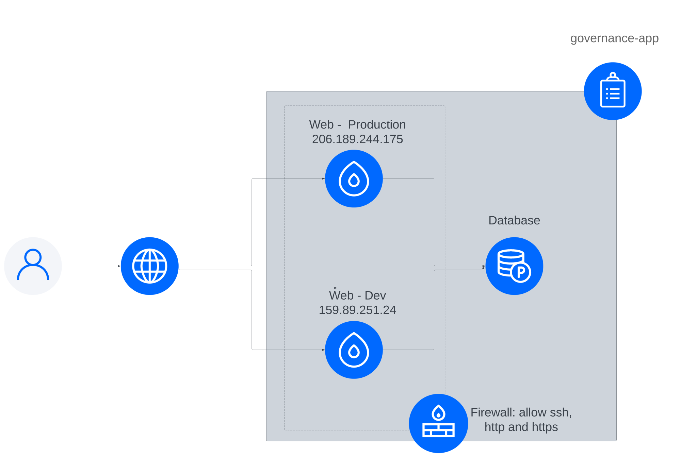

# GovernanceHub

This is a monorepo application containing multiple services that work together. The application is deployed using Docker Compose, which allows us to easily manage, build, and run these services.

## Infrastructure


the application is deployed in DigitalOcean using 2 Droplet (Review and developemt, production) and a Digitalocean Managed database

## Devops Setup
1. update and upgrade vm OS
2. install docker 
3. install docker-compose using this guide: https://docs.docker.com/compose/install/standalone/
4. install nginx
5. install certbot
6. create a user for GitHub action runner, add the user to sudoers and docker group
7. install GitHub action runner in all vms using the github docs
8. create docker network for different environment 
    ```bash
        docker network create (yuki-review | yuki-development | yuki-production)
    ```
9. add GitHub secrets and variables in github environment

## Prerequisites

- Docker: Please ensure you have Docker installed on your system. You can find the installation guide for your platform at https://docs.docker.com/engine/install/
- Docker Compose v2: Make sure Docker Compose is installed. You can find the installation guide at https://docs.docker.com/compose/install/standalone/

## Technology Stack:

- BE:

  - Typescript 4
  - NodeJs 16+
  - PostgreSQL

- FE:

To start the application, follow these steps:

1. Clone the repository:

2. Navigate to the repository's root directory:

3. Update the docker-compose.local.yml with local environment variables

4. Build and start the services using Docker Compose:
   ```bash
       docker-compose up -d -f docker-compose.local.yml
    ```
5. migrate local database using 
    ```bash
      yarn migration:generate
    ```


